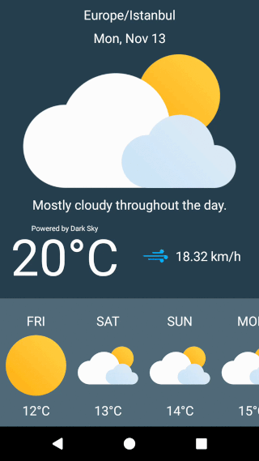

# Kotlin Weather
This is a clean and simple weather app for Android developed in Kotlin which I believe it might be a useful source for those who want the see how Kotlin language works in Android development.

<a href="https://play.google.com/store/apps/details?id=com.ardaozceviz.cleanweather">
    
</a>

## Screenshots

         

## Overview
This app basically uses GPS to determine the device's location and retrieves the 7 days forecast data accordingly from darksky's API service. In order to build this project, you will need to apply for your own API key from [darksky](https://darksky.net/dev). They have free plan which allows you to make 1000 requests per day.

## Libraries used in this project
* [Recycler Refresh Layout](https://github.com/dinuscxj/RecyclerRefreshLayout)
* [Android Async Http](https://github.com/loopj/android-async-http)
* [GSON](https://github.com/google/gson)
* [Dexter](https://github.com/Karumi/Dexter)

## Build the project
 * Clone or download the project
 * Obtain your API key from [darksky](https://darksky.net/dev)
 * Add the following attribute to your "gradle.properties" file using this format.
```groovy
API_KEY = "your_api_key_goes_here"
```
* Build the project!

## In Action!


## Others
* Welcome anyone to raise a new issue.
* Welcome anyone to push a pull request to improve the project.

## Find it helpful?
* Support me by clicking the :star: button on the upper right of this page.
* Spread it to others to let more people to have an access to this project. 

## Reference
* [Android O & Java](https://www.udemy.com/android-app-development-with-java/)
* [Kotlin for Android](https://www.udemy.com/devslopes-android-kotlin/)
* [Introduction to Kotlin Programming](http://shop.oreilly.com/product/0636920052982.do)
* [Kotlin-Weather](https://github.com/gurleensethi/kotlin-weather) by gurleensethi

## License
```license
MIT License

Copyright (c) 2017 Arda Özceviz

Permission is hereby granted, free of charge, to any person obtaining a copy
of this software and associated documentation files (the "Software"), to deal
in the Software without restriction, including without limitation the rights
to use, copy, modify, merge, publish, distribute, sublicense, and/or sell
copies of the Software, and to permit persons to whom the Software is
furnished to do so, subject to the following conditions:

The above copyright notice and this permission notice shall be included in all
copies or substantial portions of the Software.

THE SOFTWARE IS PROVIDED "AS IS", WITHOUT WARRANTY OF ANY KIND, EXPRESS OR
IMPLIED, INCLUDING BUT NOT LIMITED TO THE WARRANTIES OF MERCHANTABILITY,
FITNESS FOR A PARTICULAR PURPOSE AND NONINFRINGEMENT. IN NO EVENT SHALL THE
AUTHORS OR COPYRIGHT HOLDERS BE LIABLE FOR ANY CLAIM, DAMAGES OR OTHER
LIABILITY, WHETHER IN AN ACTION OF CONTRACT, TORT OR OTHERWISE, ARISING FROM,
OUT OF OR IN CONNECTION WITH THE SOFTWARE OR THE USE OR OTHER DEALINGS IN THE
SOFTWARE.
```
